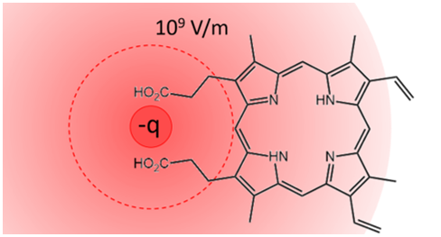

# Calculations for Protoporphyrin IX (PPIX) 

This repository contains the input files to reproduce the NEVPT2 calculations from the following paper:

> Wyatt Zagorec-Marks, James E. T. Smith, Madison M. Foreman, Sandeep Sharma, J. Mathias Weber. ___Intrinsic Electronic Spectra of Cryogenically Prepared Protoporphyrin IX Ions in Vacuo – Deprotonation-Induced Stark Shifts___. __(Submitted)__.

If this work helped you in your research please cite us using one of the following:

```
Citation coming soon!
```

## Software Details
- [PySCF](https://github.com/pyscf/pyscf) v1.7.2
  - git commit: [7ba318ff7cae650b255d5c5b90ed550521d324f0](https://github.com/pyscf/pyscf/commit/7ba318ff7cae650b255d5c5b90ed550521d324f0)
<!-- - [ORCA](https://orcaforum.kofo.mpg.de/app.php/portal) v 4.0.1.2 -->


## Reproducing the NEVPT2 Results

A summary of our results in presented in [`./analysis/NEVPT2_summart.txt`](analysis/NEVPT2_summary.txt) along with a condensed version in `csv` format in [`./analysis/sa-3-mcscf_nevpt2.csv`](analysis/sa-3-mcscf_nevpt2.csv).

To reproduce our NEVPT2 results for a particular species, navigate to that directory, ensure your Python environment is properly set up for PySCF, then execute the following:

```bash
sh run_all.sh
```

Each directory contains one of these helper scripts to make workflow easy to reproduce. Below is an snippet showing the workflow in detail:

```bash
# Run RKS Calculation
python dft.py

# Run SA-MCSCF Calculation
python sa_mcscf.py > _logs/_sa_mcscf.out

# Run PT2 Calculations on all Excited States
python pt2.py 0 > _logs/_pt2_0.out
python pt2.py 1 > _logs/_pt2_1.out
python pt2.py 2 > _logs/_pt2_2.out
```